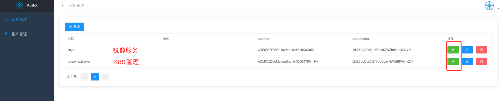

# 镜像服务使用

## 登录认证平台

- 登录认证平台, 进入 jingx 服务, 新增一个账户




- 复制新增的账户信息, 这个账户可以用来登录 jingx 服务, 并且可以用来上传镜像


## 配置环境变量

JINGX_ADDRESS 镜像服务地址

JINGX_USER 镜像服务用户名

JINGX_PASS 镜像服务密码

```sh
export JINGX_ADDRESS=127.0.0.1:8083
export JINGX_USER=kongzz
export JINGX_PASS=tlbYLGZB69SIAqiEe7zV6y2fBTYbin6e
```

## 测试上传镜像

在上传镜像之前, 需要先登录镜像服务, 新增一个项目, 类似 docker hub 的 namespace


这个时候就可以上传镜像了, 比如上传一个 nginx 的镜像

```sh
➜  gamex git:(main) ✗ cat Dockerfile
FROM nginx:latest

LABEL maintainer="kongzz"

COPY index.html /usr/share/nginx/html/
```

```sh
➜  gamex git:(main) ✗ cat index.html
<html>
  <body>
    <h1>Hello World!</h1>
  </body>
</html>
➜  gamex git:(main) ✗
```

```sh
REGISTRY_DOMAIN := ali-xxx-beijing.cr.aliyuncs.com
PROJECT := games
TAG ?= latest

build-gamex:
	docker build -f Dockerfile -t "$(REGISTRY_DOMAIN)/$(PROJECT)/$(service):$(TAG)" .
	docker push "$(REGISTRY_DOMAIN)/$(PROJECT)/$(service):$(TAG)"
	bash jingxcli.sh cli $(PROJECT) $(service) $(TAG)
```


