# 本地测试

## 集群创建

- 本地测试环境通过 kind 来创建一个 K8S 集群

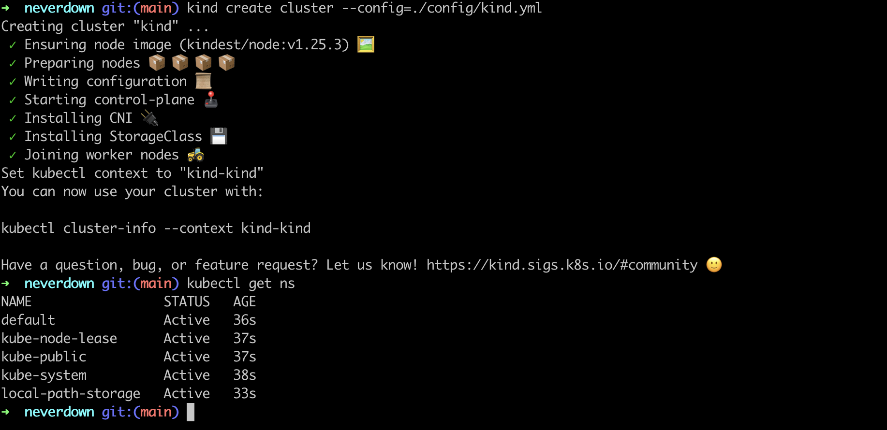

- 需要安装 metrics-server 用来获取资源使用情况

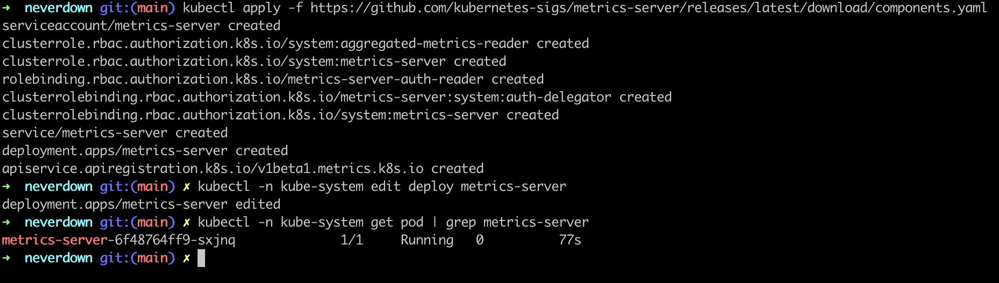

## 启动 etcd-server

- 在 K8S 环境部署好之后, 需要外部启动 etcd 服务


## 安装 CRD

- 安装 CRD

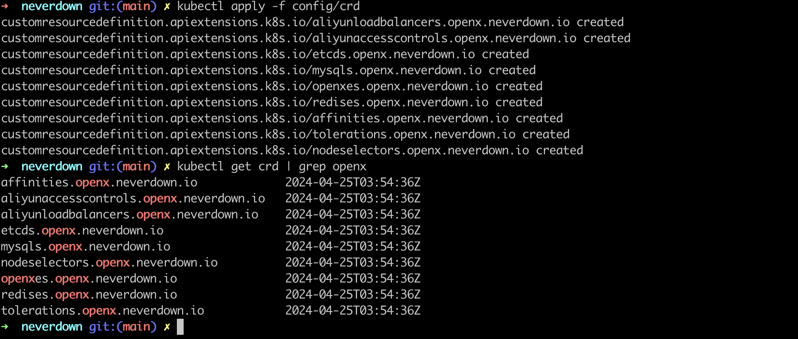

- 安装 RBAC Role
  
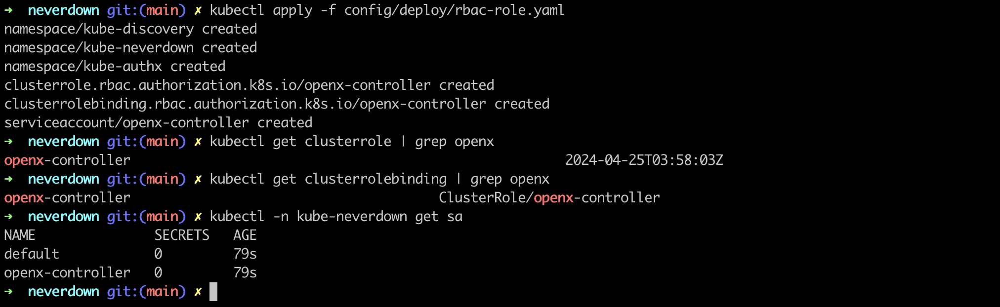

## 本地启动服务

- 启动 disovery 服务

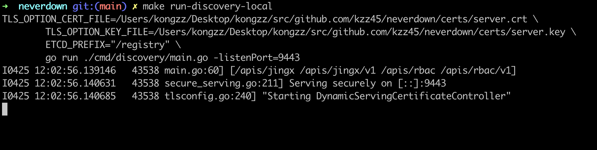

- 启动 authx-apiserver

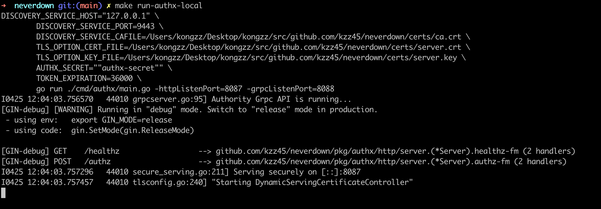

- 启动 jingx-apiserver

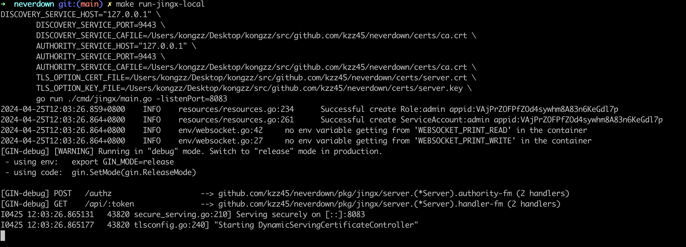

- 启动 openx-apiserver

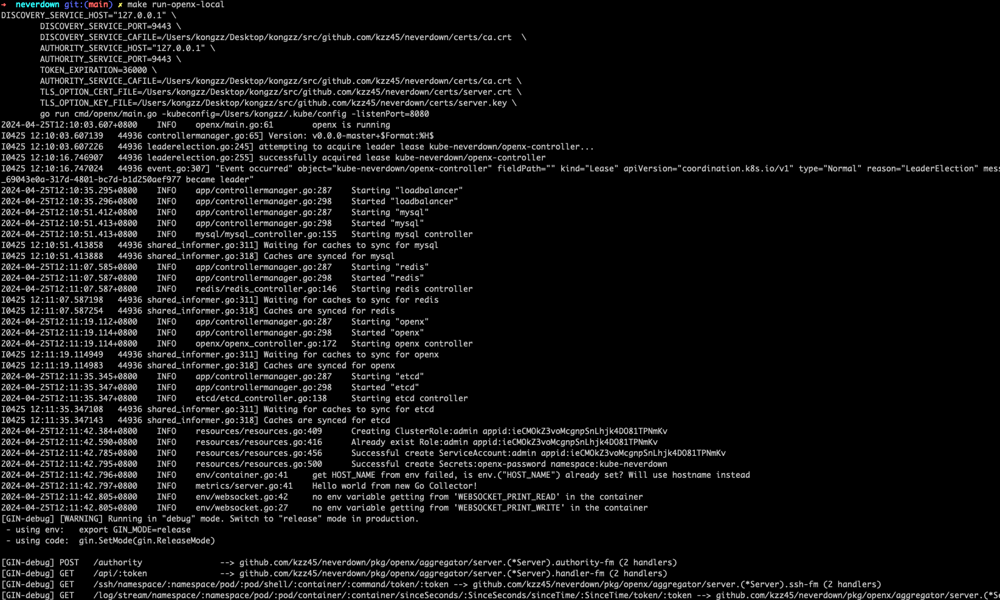

- 启动 authx-frontend 登录认证平台

```sh
make run-authx-frontend-local
```

这个时候登录认证平台之后, 会看到如下界面, 一个是镜像服务, 一个是 K8S 服务

点击后面的箭头进入, 会看到各自的账户、角色和 GVK 管理界面

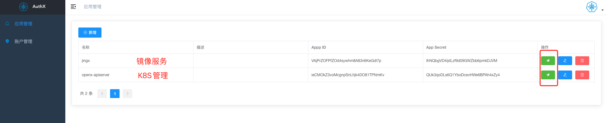

进入并复制 openx-apiserver 的登录密码

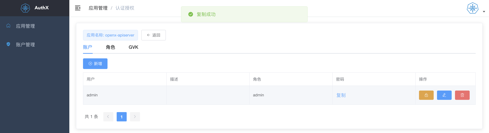

- 启动 openx-frontend 并登录

```sh
make run-openx-frontend-local
```

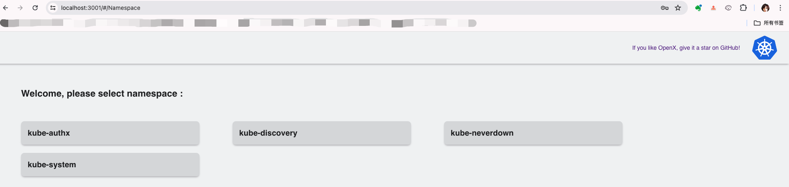

- 测试创建 nginx 服务

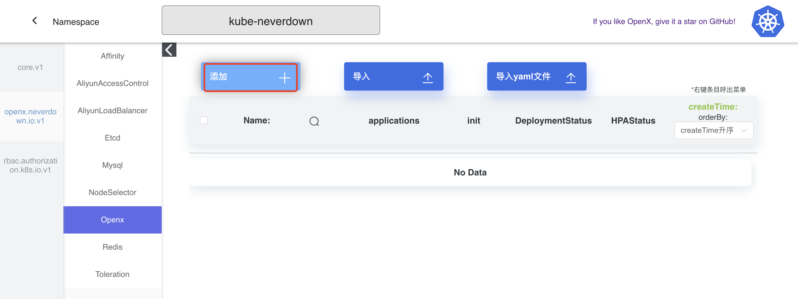

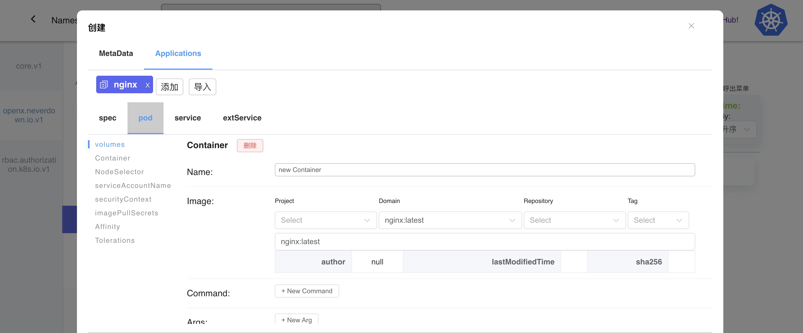

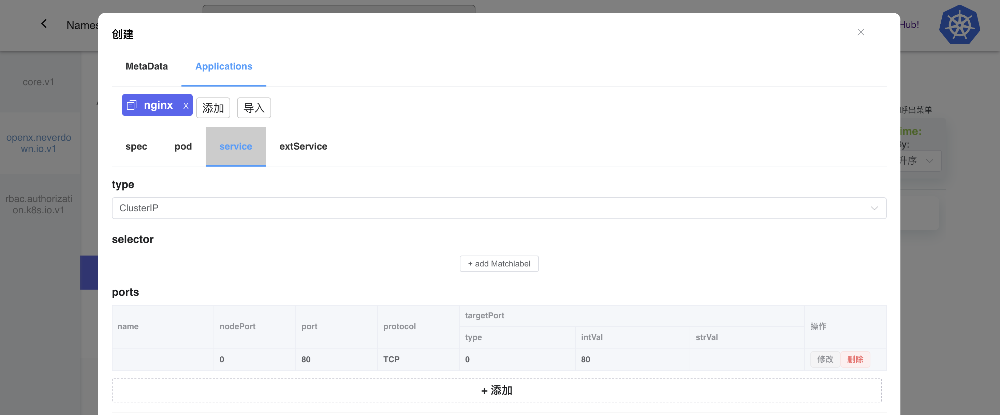

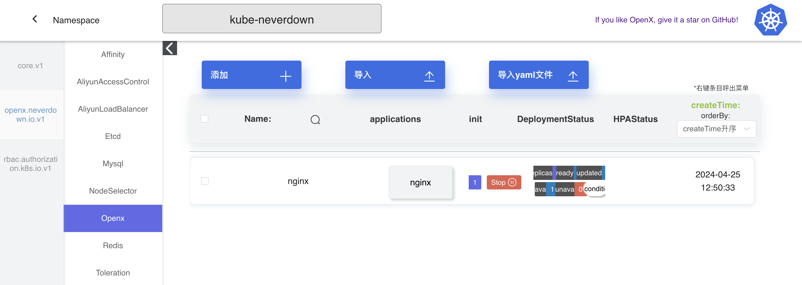

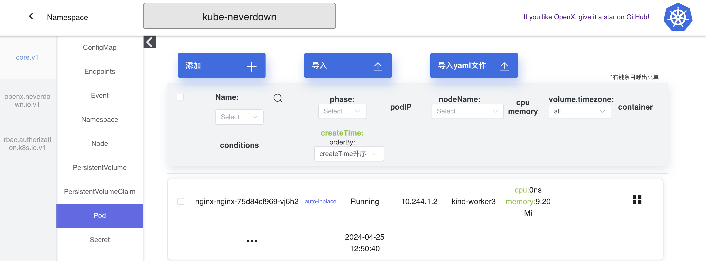

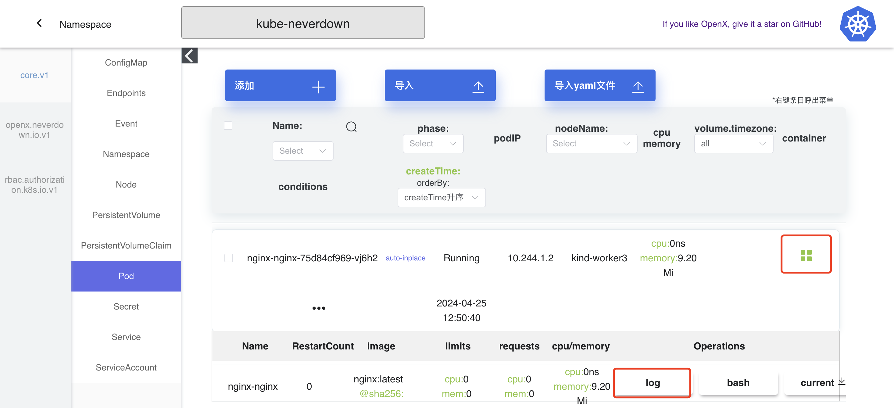

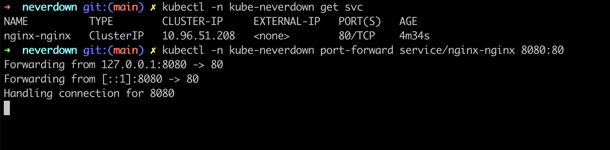


