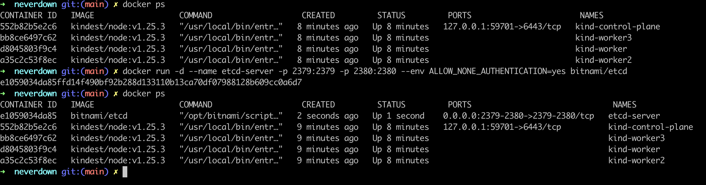

# 本地测试

- 本地测试环境通过 kind 来创建一个 K8S 集群


- 需要安装 metrics-server 用来获取资源使用情况


- 在 K8S 环境部署好之后, 需要外部启动 etcd 服务



- 安装 CRD


- 安装 RBAC Role
  


- 启动 disovery 服务


- 启动 authx-apiserver


- 启动 jingx-apiserver


- 启动 openx-apiserver


- 启动 authx-frontend 并复制 openx-apiserver 的密码

```sh
make run-authx-frontend-local
```


- 启动 openx-frontend 并登录

```sh
make run-openx-frontend-local
```


- 测试创建 nginx 服务


