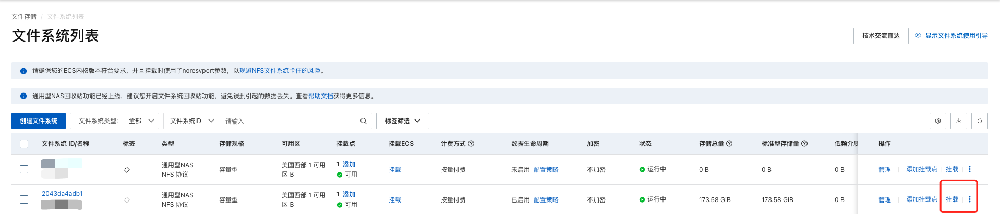

# 使用说明

## 购买资源

线上部署, 我们这边是使用的阿里云的 ACK, 使用了阿里云的 CLB 和 ACL 服务, 以及 NAS 服务

1. 购买 阿里云 ACK 集群

2. 购买 阿里云 NAS, `并将集群中的 node 节点挂载到 NAS 上`



3. 购买 阿里云 CLB 和 ACL 服务

## 部署

1. 这里建议重新生成一个证书, 使用 `./certs/gen-cert.sh` 生成的证书

```ext
authorityKeyIdentifier=keyid,issuer
basicConstraints=CA:FALSE
keyUsage = digitalSignature, nonRepudiation, keyEncipherment, dataEncipherment
subjectAltName = @alt_names

[alt_names]
IP.1 = 127.0.0.1
DNS.1 = localhost
DNS.2 = *.*.svc.cluster.local
DNS.3 = *.kube-authx.svc.cluster.local
DNS.4 = *.kube-system.svc.cluster.local
DNS.5 = *.kube-neverdown.svc.cluster.local
DNS.6 = *.kube-discovery.svc.cluster.local
DNS.7 = 你自己的域名, 比如: k8splatform.example.com
```

2. 修改 `config/deploy/neverdown-deploy.yaml` 中的 `configmap` 里证书配置

```sh
# 安装 CRD
kubectl apply -f config/crd/

# 部署服务
kubectl apply -f config/deploy/
```

3. 需要将 jingx-apiserver 和 authx-apiserver 以及 openx-apiserver 的 SVC 配置为 LoadBalancer 类型, 否则无法访问

4. 配置一个域名, 比如: k8splatform.example.com, 解析到 阿里云 CLB 的 IP

5. 访问 https://k8splatform.example.com, 即可看到登录页面
